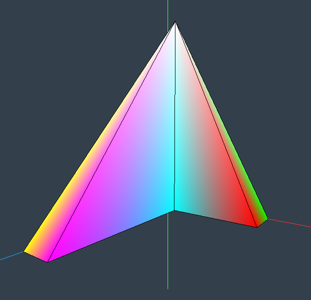

# Practice 1 - Computer Graphics

## System Requirements

To run this practice on Linux, you need to have the following packages installed:

### Install necessary packages on Linux:
```bash
sudo apt install build-essential
sudo apt install cmake
sudo apt install libglew-dev libglfw3-dev libglm-dev libjpeg-dev
```

## Opening the Project

    1. Navigate to the _builds/linux_ folder.
    2. Open the _workspace.code-workspace_ file using Visual Studio Code.

## Compiling the Project

    1. Clear the contents of the _cmake_ folder.

    2. Open a terminal in the _cmake_ folder and run the following commands:

```bash
cmake ..
make
```
    

    3. An executable called _debug_exe_ will be created in the bin folder.

    4. Navigate to the bin folder and run the executable to start the project.

## About the Practice

In Practice 1, we have created several figures, such as:

    - Cube
    - Colored cube
    - Tetrahedron
    - House
    - And more...

The vertices, faces, and colors of these figures are implemented in the _malla-ind.cpp_ class, where each figure is represented by its own class.

* Example Images

Here are some example images of the rendered figures in the scene:
Cube: 

Pyramid with L-base: 


TRiangle: 

House: 

### Displaying Figures

To display a specific figure, you need to edit the _escena.cpp_ file. In the _Escena1_ class, add a _push_back_ with the objects you want to display.

* Controls

You can visualize the figures and interact with the application using the following controls:

    - Arrow keys: Navigate through the scene.
    - W key: Display the edges of the figures.
    - O key: Switch to the next object.
    - M key: Change the rendering mode.
    
